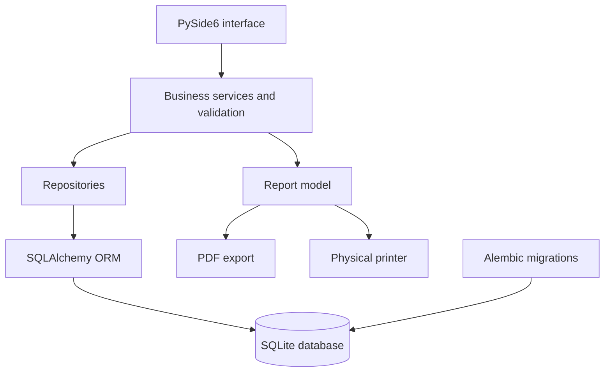

<p align="center">
  
</p>

<h1 align="center">Work Scheduler</h1>

<p align="center">
  A local-first desktop application for planning, validating, finalizing, and printing employee work schedules.
</p>

<p align="center">
  <a href="https://github.com/eliaszpiotr/Work-Schedule/releases/latest"></a>
  <a href="https://www.python.org/"></a>
  <a href="https://doc.qt.io/qtforpython-6/"></a>
  <a href="LICENSE"></a>
</p>

## Overview

Work Scheduler is a cross-platform desktop application designed for small pharmacies that need a clear and dependable way to organize employee shifts. Its scheduling rules are tailored to Polish pharmacy operations, including continuous pharmacist coverage during opening hours and automatic recognition of Polish public holidays. The application combines a fast day-by-person schedule editor with opening-hours rules, schedule review, and print-ready reporting.

The application runs entirely on the user's computer. It requires no account, remote server, or internet connection, and stores operational data in a private local SQLite database. The interface and printed reports are available in Polish and English.

## Core Capabilities

- Manage pharmacists and pharmacy technicians while preserving inactive employees in historical schedules.
- Create schedules in a day-by-person grid with direct keyboard entry and automatic hour totals.
- Apply weekly opening hours, Polish public holidays, and manual exceptions for individual dates.
- Detect empty working days, missing pharmacist coverage, shifts outside opening hours, and employees without assigned work.
- Finalize reviewed schedules and produce consistent PDF or physical printouts for the pharmacy and individual employees.

## Application Workflow

1. Add employees and assign each person a professional role.
2. Configure the pharmacy's standard weekly opening hours.
3. Create a schedule, choose its period and team, then enter working hours in the grid.
4. Review validation findings, finalize the schedule, and export or print the result.

Every edit is saved immediately in its own database transaction. If an operation fails, the transaction is rolled back and the database remains consistent.

## Schedule Editor

The schedule grid uses days as rows and employees as columns. Each cell represents one employee's shift on one calendar date.

Accepted input formats include:

```text
8-16
8:30-17:00
8.30 do 16.30
08:00–20:00
```

Each employee can have at most one shift per day. A shift must end later than it starts and cannot cross midnight. Empty cells remove previously assigned shifts.

The editor calculates totals per employee and visually distinguishes closed days, public holidays, insufficient pharmacist coverage, and shifts extending beyond the pharmacy's opening hours.

## Opening Hours and Holidays

Global opening hours define the pharmacy's standard week. When a schedule is created, it receives its own copy of those hours so later changes to the settings do not rewrite historical schedules.

Polish public holidays are calculated locally, including movable holidays based on Easter. A specific date can be opened or closed manually without changing the standard weekly configuration. Only these exceptions are stored in the database.

## Polish Pharmacy Scheduling Rules

The validation model reflects the operational requirement that an open pharmacy must remain under the coverage of a qualified pharmacist (`magister farmacji`). Work Scheduler analyses every staffed period within the configured opening hours and identifies gaps where employees are scheduled but no pharmacist is present.

The built-in Polish holiday calendar covers fixed and movable public holidays, including Easter-based dates and Christmas Eve from 2025 onward. Holidays are treated as closed by default unless a schedule contains a manual opening-hours exception for that date.

## Validation and Finalization

Before a schedule is finalized, Work Scheduler checks for:

- open days without any assigned employees,
- periods without pharmacist coverage,
- shifts outside the configured opening hours,
- employees without any assigned shifts.

An open day with no assigned employees blocks finalization. Other findings are presented as warnings so the person preparing the schedule can make the final operational decision.

Finalized schedules are marked as reviewed and become available for PDF export and printing. Editing a finalized schedule automatically returns it to draft status, ensuring that the stored status always reflects whether the latest version has been checked.

## Reports and Printing

The reporting system creates a database-independent representation of the schedule before drawing any output. The same report data is used for PDF files and physical printing, keeping both formats consistent.

A report contains:

- a complete schedule overview,
- the covered date range and opening information,
- employee roles and total working hours,
- individual pages with each employee's assignments.

The print language can follow the interface language or be selected independently. Exported files receive private permissions on supported operating systems.

## Interface and Accessibility

The application provides three focused workspaces: **Schedules**, **Employees**, and **Settings**. The sidebar can be collapsed to maximize the schedule area, and the interface supports light, dark, and operating-system-controlled themes.

The UI uses native Qt controls, keyboard-accessible tables and dialogs, localized labels, explicit confirmation for destructive actions, and visual legends for schedule warnings.

## Download

Packaged versions are published on the [GitHub Releases](https://github.com/eliaszpiotr/Work-Schedule/releases) page. Each release contains its supported platforms, installation files, release notes, and known limitations.

Until packaged builds are available, install Work Scheduler from source.

## Install from Source

### Requirements

- Python 3.12
- macOS, Windows, or Linux with desktop Qt support

### Installation

```bash
git clone https://github.com/eliaszpiotr/Work-Schedule.git
cd Work-Schedule
python3.12 -m venv .venv
source .venv/bin/activate
python -m pip install -r requirements.txt -e .
work-scheduler
```

On Windows, activate the virtual environment with:

```powershell
.venv\Scripts\activate
```

The application can also be started directly:

```bash
python -m work_scheduler
```

## Data Storage and Privacy

Work Scheduler stores its SQLite database in the operating system's standard application-data directory:

| Platform | Default database location |
| --- | --- |
| macOS | `~/Library/Application Support/WorkScheduler/work_scheduler.db` |
| Windows | `%LOCALAPPDATA%\WorkScheduler\work_scheduler.db` |
| Linux | `$XDG_DATA_HOME/work-scheduler/work_scheduler.db` |

Set the `WORK_SCHEDULER_DB` environment variable to use a custom database path.

The application creates a backup before applying database migrations and retains the five most recent copies. On supported systems, application directories are restricted to the current user and database files, backups, exports, and generated icon files receive private file permissions.

## Architecture

Work Scheduler follows a layered architecture that keeps interface code, business rules, persistence, and document rendering separate.



The service layer owns validation and transaction boundaries. Repository classes isolate database queries, while the interface operates on plain data structures rather than long-lived ORM sessions.

### Project Structure

```text
src/work_scheduler/
├── database/      SQLAlchemy models, repositories, sessions, and startup
├── export/        PDF and printer rendering
├── i18n/          Polish and English translation catalogues
├── migrations/    Alembic database migrations
├── services/      Business rules, validation, holidays, and reports
└── ui/            PySide6 windows, dialogs, views, themes, and assets

tests/             Unit, integration, UI, migration, export, and security tests
docs/              Architecture notes, design specifications, and security audit
tools/             Development utilities
```

## Development

Install the development dependencies:

```bash
python -m pip install -r requirements-dev.txt -e .
```

Run the complete test suite:

```bash
python -m pytest
```

Run static code-quality checks:

```bash
ruff check .
```

The automated test suite covers the schema, migrations, transaction handling, business services, schedule validation, holiday calculations, Qt interface, localization, themes, PDF output, backups, and file permissions.

## Release Process

1. Update the version in `pyproject.toml` and `src/work_scheduler/__init__.py`.
2. Update `packaging/RELEASE_NOTES.md` to describe the new version.
3. Merge the reviewed changes into the protected `main` branch.
4. Push a version tag such as `v0.2.0`.

Pushing the tag starts the `Release` workflow, which runs the test suite and Ruff, builds the desktop packages on macOS (Apple Silicon and Intel), Windows, and Linux, and opens a draft GitHub Release with the four downloads attached. Review the draft and publish it.

Before creating the tag, run the workflow manually from GitHub Actions to verify all four platform builds. A tag is accepted only when it matches the versions in both `pyproject.toml` and `work_scheduler.__version__`.

To build a package locally on the current platform:

```bash
pyinstaller --noconfirm --clean packaging/work-scheduler.spec
```

The builds are not code-signed, so macOS and Windows warn once on the first launch.

## Documentation

Technical handoff notes, architecture decisions, interface specifications, and the security audit are available in [`docs/`](docs/).

## License

Work Scheduler is licensed under the [GNU Affero General Public License v3.0 only](LICENSE).

Licensing and attribution details for bundled third-party software, fonts, and icons are listed in [THIRD_PARTY_NOTICES.md](THIRD_PARTY_NOTICES.md).

You may use, study, modify, and redistribute the software under the conditions of the AGPL. Modified versions that are distributed or made available to users over a network must preserve the same license and provide the corresponding source code.

Copyright © 2026 Eliasz Piotr.
